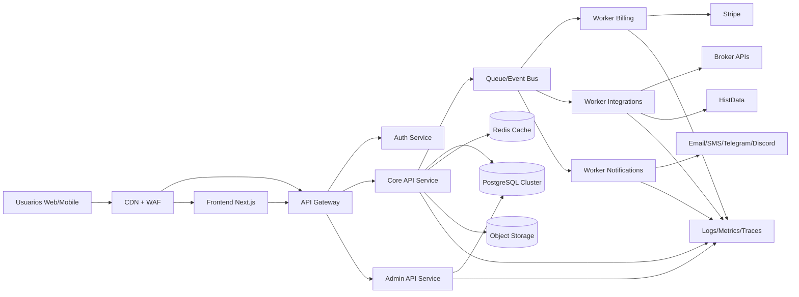

# ARQUITECTURA ENTERPRISE CARVIPIX

Fecha: 2026-07-03  
Propietario: CTO Office  
Estado: Aprobado para ejecución por fases  
Horizonte: 5 años

---

## 0. Principios de ingeniería (obligatorios)

1. Seguridad por defecto: deny-by-default, mínimo privilegio, trazabilidad completa.
2. Diseño para resiliencia: todo componente crítico debe tolerar fallos parciales.
3. Escalado progresivo: no sobreingeniería temprana, sí rutas claras de evolución.
4. Contratos estables: APIs versionadas y backward compatible.
5. Operación auditable: cada cambio sensible debe dejar evidencia técnica y de negocio.
6. FinOps activo: coste por usuario, por request y por integración monitorizado mensualmente.
7. Datos primero: sin consistencia de datos no hay producto financiero confiable.

---

## 1) Arquitectura completa

## 1.1 Vista macro objetivo

CARVIPIX se construye en tres planos:

- Plano de experiencia: web app y panel administrativo.
- Plano de negocio: APIs core, servicios de dominio, orquestación de pagos y brokers.
- Plano de datos y operación: base de datos, cache, colas, observabilidad, seguridad y continuidad.

## 1.2 Frontend

Arquitectura objetivo:
- Next.js App Router como BFF ligero para experiencia web.
- Render híbrido:
  - SSR para áreas privadas y datos sensibles.
  - SSG para contenido comercial/documental.
  - ISR para páginas con actualización periódica.
- Separación de capas:
  - Presentación.
  - Estado de sesión.
  - Cliente API tipado y versionado.
- Reglas críticas:
  - Cero lógica de autorización real en cliente.
  - Cero secretos en cliente.
  - Todas las acciones sensibles requieren idempotencia y trazabilidad.

## 1.3 Backend

Arquitectura objetivo por servicios lógicos (inicialmente monolito modular, luego servicios separados):
- Auth & Identity.
- User & Membership.
- Billing & Subscriptions.
- Trading Orchestration.
- Integrations Hub.
- Notifications.
- Admin Governance.
- Audit & Compliance.

Patrón recomendado:
- HTTP APIs para operaciones síncronas.
- Queue/Event-driven para procesos largos o integraciones externas.
- Outbox pattern para asegurar entrega de eventos sin pérdida.

## 1.4 Base de datos

Motor principal:
- PostgreSQL gestionado en modo HA.
- Réplica de lectura desde etapa de 10,000 usuarios.
- Particionado por tiempo para tablas de eventos y logs funcionales.

Reglas:
- Migraciones forward-only con rollback compensatorio.
- Integridad referencial estricta.
- Auditoría de entidades sensibles con historial.

## 1.5 Storage

- Object Storage (S3-compatible) para:
  - Reportes.
  - Exportaciones.
  - Adjuntos de soporte.
  - Artefactos de cumplimiento.
- Cifrado en reposo y versionado activado.
- Política de lifecycle por tipo de objeto (hot, warm, archive).

## 1.6 Cache

- Redis como cache distribuido y almacenamiento temporal:
  - Sesiones cortas no sensibles.
  - Rate limit counters.
  - Caches de lectura de APIs externas.
  - Locks distribuidos para jobs críticos.
- TTL por dominio y política explícita de invalidación.

## 1.7 Workers

Tipos de workers:
- Billing Worker: Stripe webhooks, reconciliación, facturas.
- Integration Worker: brokers, HistData, TradingView.
- Notification Worker: email, SMS, Telegram, Discord.
- Risk Worker: validaciones de riesgo y reglas operativas.
- Cleanup Worker: housekeeping, retención y compactación.

Requisitos:
- Idempotencia por job.
- Reintentos con backoff exponencial + jitter.
- Dead-letter queue para análisis de fallos.

## 1.8 Cron Jobs

Jobs obligatorios:
- Reconciliación Stripe diaria.
- Verificación de suscripciones vencidas (cada hora).
- Rotación y limpieza de tokens revocados.
- Compresión y archivado de eventos antiguos.
- Healthcheck sintético de APIs externas.
- Validación de backups y prueba de restauración programada.

## 1.9 Queue

- Cola principal con semántica at-least-once.
- Claves de deduplicación por evento externo.
- Prioridades:
  - Alta: pagos, autenticación, control de riesgo.
  - Media: sincronizaciones de estado.
  - Baja: notificaciones no críticas.
- SLA de procesamiento definido por tipo de evento.

## 1.10 Logs

- Logging estructurado JSON.
- Correlation ID y Request ID obligatorios.
- Campos mínimos:
  - actor_id
  - tenant_id (si aplica)
  - endpoint
  - latency_ms
  - error_code
  - integration_provider
- Política:
  - Sin secretos en logs.
  - Redacción automática de PII sensible.

## 1.11 Monitoreo

Pilares:
- Métricas: latencia, tasa de error, throughput, saturación.
- Trazas distribuidas: front -> gateway -> service -> DB/integración.
- Alertas accionables:
  - SLO burn rate.
  - fallo de webhook.
  - picos de 401/403/429.
  - drift de estado de suscripción.

## 1.12 Backups

- PostgreSQL:
  - PITR habilitado.
  - Snapshots diarios.
  - Retención multinivel (7/30/180 días).
- Object storage:
  - Versionado + replicación cruzada de región para datos críticos.
- Pruebas:
  - Restore test mensual obligatorio.
- Objetivos:
  - RPO <= 15 minutos.
  - RTO <= 60 minutos para servicios core.

## 1.13 CDN

- CDN global para contenido estático y assets.
- Edge caching con invalidación selectiva.
- Protección anti-bot y mitigación de scraping masivo.

## 1.14 API Gateway

Funciones obligatorias:
- Terminación TLS.
- Rate limiting por IP/usuario/clave.
- Validación de JWT.
- Enrutamiento por versión de API.
- Circuit breaking y timeout policy centralizados.
- Registro de auditoría de tráfico administrativo.

---

## 2) Escalabilidad por etapas

## 2.1 100 usuarios

Arquitectura:
- Monolito modular + DB única + Redis único.
- Queue gestionada básica.

Cambios clave:
- Prioridad en seguridad base, trazabilidad y contratos API.
- Carga de trabajo principal: validación de producto.

Operación:
- Deploy diario aceptable.
- On-call básico.

## 2.2 1,000 usuarios

Arquitectura:
- Separación de workers del proceso API.
- Read cache activa para endpoints de lectura frecuente.

Cambios clave:
- Introducir dashboards SLO.
- Iniciar pruebas de carga semanales.

Operación:
- Guardias rotativas en horario comercial.

## 2.3 10,000 usuarios

Arquitectura:
- Réplica de lectura PostgreSQL.
- API Gateway dedicado.
- Servicios lógicos separados: Auth y Billing.

Cambios clave:
- Queue con DLQ por dominio.
- Primer plan formal de capacidad trimestral.

Operación:
- On-call 24/7.
- Gestión de incidentes formal (SEV1-SEV3).

## 2.4 100,000 usuarios

Arquitectura:
- Escalado horizontal automático de APIs y workers.
- Particionado de tablas de eventos y auditoría.
- Cache distribuido por namespaces.

Cambios clave:
- Multi-región activa-pasiva para DR.
- Aislamiento de integraciones externas en Integration Hub.

Operación:
- SRE dedicado.
- Chaos testing controlado trimestral.

## 2.5 1,000,000 usuarios

Arquitectura:
- Multi-región activa-activa para planos no transaccionales.
- Sharding lógico por dominio/tenant para cargas extremas.
- Event backbone robusto con replay controlado.

Cambios clave:
- Segmentación de datos por jurisdicción/compliance.
- Governance de datos y seguridad con comité técnico.

Operación:
- NOC/SOC 24/7.
- Presupuesto de resiliencia y continuidad anual.

---

## 3) Seguridad

## 3.1 Roles

Roles mínimos:
- guest
- user
- support
- analyst
- billing_admin
- security_admin
- super_admin (uso restringido y controlado)

Regla:
- Segregación de funciones obligatoria en operaciones críticas.

## 3.2 Permisos

- Modelo RBAC con capacidad ABAC para casos de alto detalle.
- Permisos evaluados en backend y gateway.
- Política deny-by-default para rutas administrativas.

## 3.3 Autenticación

- Login con credenciales fuertes + políticas anti abuso.
- Session management con refresh token rotatorio.
- Revocación por dispositivo y por riesgo.

## 3.4 2FA

- Obligatorio para:
  - administración
  - operaciones de billing
  - acciones de riesgo elevado
- Preferencia TOTP + fallback recovery codes.

## 3.5 JWT

- Access token de corta vida.
- Claims mínimos y firmados.
- Validación estricta de issuer, audience y expiration.

## 3.6 Rotación de tokens

- Rotación de refresh token en cada uso.
- Detección de reuse y bloqueo preventivo de sesión.
- Blacklist temporal en Redis + persistencia de eventos de revocación.

## 3.7 Rate Limit

- Por capa:
  - CDN/WAF.
  - API Gateway.
  - Endpoint sensible.
- Estrategia adaptativa según riesgo y reputación de cliente.

## 3.8 Firewall

- WAF gestionado con reglas OWASP Top 10.
- Reglas custom para rutas de login/admin/webhook.
- Bloqueo geográfico si riesgo regulatorio lo exige.

## 3.9 Protección DDoS

- Anti-DDoS del proveedor cloud en capa edge.
- Autoscaling con límites y protección de presupuesto.
- Modo degradado para preservar operaciones core.

## 3.10 Encriptación

- En tránsito: TLS 1.2+.
- En reposo: cifrado gestionado por KMS.
- Campos sensibles cifrados a nivel aplicación cuando aplique.

## 3.11 Auditoría

- Auditoría inmutable para:
  - cambios de rol
  - cambios de suscripción
  - accesos admin
  - eventos de seguridad
- Retención y exportación para cumplimiento.

---

## 4) APIs futuras (catálogo enterprise)

Convenciones globales:
- Versionado /v1, /v2.
- Idempotency-Key obligatoria en operaciones financieras.
- Correlation ID obligatorio.
- Error model estandarizado.

## 4.1 Trading API

Capacidades:
- Señales, posiciones, métricas, riesgo, estado de estrategia (sin lógica de estrategia en este documento).
- Endpoint de lectura optimizado para dashboard.

Controles:
- Circuit breaker interno.
- Control de latencia p95 por endpoint.

## 4.2 Broker API

Capacidades:
- Conectores por broker con interfaz común.
- Ordenes, estados, balances, fills.

Controles:
- Mapping de errores por proveedor.
- Fallback y reconciliación asíncrona.

## 4.3 Stripe API

Capacidades:
- Checkout, customer portal, suscripciones, invoices.
- Webhook ingestion robusto.

Controles:
- Verificación de firma.
- Dedupe por event_id.
- Reconciliación diaria automatizada.

## 4.4 Telegram API

Capacidades:
- Alertas operativas, notificaciones críticas y comandos limitados.

Controles:
- Throttling por canal.
- Plantillas y sanitización de mensajes.

## 4.5 Email API

Capacidades:
- Transaccional, seguridad y billing.

Controles:
- Retry policy.
- Tracking de entrega y rebotes.

## 4.6 SMS API

Capacidades:
- OTP y alertas urgentes.

Controles:
- Cost guardrails.
- Reintento con priorización por criticidad.

## 4.7 OpenAI API

Capacidades:
- Asistencia contextual y resúmenes.

Controles:
- Redacción de datos sensibles.
- Límites de coste por usuario/mes.
- Cache de respuestas no sensibles cuando sea viable.

## 4.8 HistData API

Capacidades:
- Ingesta histórica y sincronización incremental.

Controles:
- Validación de integridad por lote.
- Backfill controlado y trazable.

## 4.9 TradingView API

Capacidades:
- Alertas y señales externas.

Controles:
- Verificación de origen de webhook.
- Firma y nonce para anti replay.

## 4.10 Discord API

Capacidades:
- Alertas de comunidad, estatus técnico y anuncios.

Controles:
- Rate control por servidor/canal.
- Moderación de payload.

## 4.11 Webhooks Platform API

Capacidades:
- Emisión de eventos CARVIPIX hacia clientes/partners.

Controles:
- Firma HMAC.
- Reintentos con backoff.
- DLQ y panel de replay.

---

## 5) Base de datos

## 5.1 Modelo ideal (alto nivel)

Dominios de tablas:

1. Identidad y acceso
- users
- user_profiles
- roles
- permissions
- role_permissions
- user_roles
- sessions
- refresh_tokens
- mfa_methods
- security_events

2. Billing y suscripciones
- customers
- products
- prices
- subscriptions
- subscription_items
- invoices
- payments
- stripe_events
- billing_reconciliation_runs

3. Trading e integración
- broker_accounts
- broker_connections
- orders
- executions
- positions
- market_data_jobs
- integration_events
- webhook_deliveries

4. Notificaciones
- notification_templates
- notification_jobs
- notification_deliveries

5. Gobernanza y auditoría
- admin_actions
- audit_log
- change_history
- incident_records

6. Operación técnica
- api_keys
- rate_limit_counters (si se persiste)
- background_jobs
- dead_letter_events

## 5.2 Relaciones clave

- users 1:N sessions
- users N:M roles (user_roles)
- roles N:M permissions (role_permissions)
- customers 1:N subscriptions
- subscriptions 1:N invoices
- invoices 1:N payments
- stripe_events 1:N billing_reconciliation_runs (por agrupación temporal)
- broker_accounts 1:N orders
- orders 1:N executions
- users 1:N broker_accounts
- users 1:N admin_actions (cuando actúa como admin)
- audit_log referencia entidad_tipo + entidad_id + actor_id

## 5.3 Índices obligatorios

Autenticación y seguridad:
- users(email) unique
- sessions(user_id, expires_at)
- refresh_tokens(token_hash) unique
- security_events(user_id, created_at desc)

Billing:
- subscriptions(customer_id, status)
- invoices(subscription_id, created_at desc)
- payments(invoice_id, status)
- stripe_events(event_id) unique

Trading e integraciones:
- orders(broker_account_id, created_at desc)
- executions(order_id, executed_at)
- integration_events(provider, created_at desc)
- webhook_deliveries(endpoint_id, status, created_at)

Auditoría:
- audit_log(entity_type, entity_id, created_at desc)
- admin_actions(actor_id, created_at desc)

## 5.4 Particiones

Particionar por fecha (mensual o semanal según volumen):
- audit_log
- integration_events
- stripe_events
- security_events
- webhook_deliveries

Regla:
- particiones activas en hot storage 3-6 meses, luego archive según política.

## 5.5 Auditoría de datos

- CDC o journaling para tablas financieras y de seguridad.
- Cadena de custodia de cambios administrativos.
- Evidencia exportable para revisiones internas/externas.

---

## 6) Panel administrativo enterprise

## 6.1 Objetivo

El panel admin es un sistema de control operativo y cumplimiento, no solo una pantalla de gestión.

## 6.2 Módulos obligatorios

- Control de usuarios y roles.
- Control de suscripciones y pagos.
- Salud de integraciones externas.
- Gestión de incidentes y alertas.
- Auditoría y trazabilidad.
- Herramientas de soporte con acciones seguras y reversibles.

## 6.3 Permisos

- RBAC estricto por acción, no solo por sección.
- Operaciones destructivas con doble confirmación.
- Acciones de alto impacto con principio de cuatro ojos (dual control).

## 6.4 Logs y control

- Toda acción admin genera evento en admin_actions y audit_log.
- Capturar:
  - actor
  - motivo
  - entidad objetivo
  - before/after
  - request_id
- Exportación de auditoría por rango de fechas.

## 6.5 Alertas operativas

Alertas mínimas:
- fallo repetido en webhook Stripe.
- incremento brusco de errores 401/403/429.
- degradación p95 de APIs críticas.
- drift entre estado Stripe y estado local.
- fallos en jobs críticos o crecimiento de DLQ.

## 6.6 Auditoría administrativa

- Sesiones admin con caducidad corta y reautenticación para acciones sensibles.
- 2FA obligatorio.
- Registro inmutable de accesos y cambios.

---

## 7) Sistema de errores y continuidad operativa

## 7.1 Detección de errores

Capas de detección:
- Frontend: errores de navegación y consumo de API.
- API: excepciones controladas y no controladas.
- Integraciones: timeouts, respuestas inválidas, rechazos.
- Datos: inconsistencias de reconciliación.

## 7.2 Reporte de errores

- Error envelope estándar:
  - error_code
  - message
  - retryable
  - correlation_id
  - domain
- Clasificación:
  - SEV1: impacto financiero/caída crítica.
  - SEV2: degradación severa.
  - SEV3: fallo parcial sin riesgo crítico.

## 7.3 Recuperación

- Retries con límites y backoff.
- Circuit breaker por proveedor.
- Fallback a modo degradado en funcionalidades no críticas.
- Reconciliación posterior para consistencia.

## 7.4 Reinicio de procesos

- Workers sin estado local persistente.
- Reinicio seguro con reanudación por offset/job checkpoint.
- Replay desde DLQ con controles de idempotencia.

## 7.5 Evitar pérdida de datos

- Outbox pattern para eventos de negocio.
- Transacciones atómicas en operaciones financieras.
- Idempotencia en operaciones externas y webhooks.
- Backups y PITR verificados.
- Política de no borrado físico inmediato en entidades críticas.

---

## 8) Roadmap de construcción

## 8.1 Qué construir primero (fundacional)

1. Seguridad base enterprise:
- RBAC backend centralizado.
- 2FA admin.
- JWT + rotación de refresh token + revocación.
- WAF + rate limiting multicapa.

2. Núcleo operativo confiable:
- API Gateway con políticas centralizadas.
- Observabilidad completa (logs, métricas, trazas).
- Estandarización de errores.

3. Datos y continuidad:
- Modelo PostgreSQL objetivo mínimo viable.
- Migraciones controladas.
- Backups con prueba de restore.

4. Billing robusto:
- Webhooks Stripe en cola con dedupe.
- Reconciliación diaria automatizada.

## 8.2 Qué construir después (escalado)

1. Separación de servicios por dominio:
- Auth/Billing/Integrations como unidades aisladas.

2. Escalado de datos:
- Réplicas de lectura.
- Particionado de eventos/auditoría.

3. Resiliencia avanzada:
- Multi-región DR.
- Chaos testing controlado.

4. Gobierno enterprise:
- comité mensual de capacidad, seguridad y costes.

## 8.3 Qué nunca construir

1. Lógica de permisos crítica solo en frontend.
2. Procesamiento de pagos sin idempotencia ni reconciliación.
3. Dependencia de un único proveedor sin estrategia de fallo.
4. Logs sin trazabilidad o con fuga de secretos.
5. Operaciones admin sin auditoría inmutable.
6. Mecanismos manuales recurrentes para tareas críticas que deben ser automáticas.
7. Arquitectura distribuida compleja prematura antes de validar umbrales de carga reales.

---

## 9) SLOs objetivo por etapa

Etapa 1 (hasta 1,000 usuarios):
- Disponibilidad core: 99.9%
- p95 API crítica: < 400 ms
- éxito webhook Stripe: > 99.5% en 5 min

Etapa 2 (hasta 100,000 usuarios):
- Disponibilidad core: 99.95%
- p95 API crítica: < 300 ms
- éxito webhook Stripe: > 99.9% en 2 min

Etapa 3 (1,000,000 usuarios):
- Disponibilidad core: 99.99%
- p95 API crítica: < 250 ms
- MTTR SEV1: < 30 min

---

## 10) Gobierno técnico y toma de decisiones

Ritmos obligatorios:
- Revisión semanal de incidentes y acciones correctivas.
- Revisión quincenal de capacidad y costes.
- Revisión mensual de seguridad y cumplimiento.
- Revisión trimestral de resiliencia y pruebas de recuperación.

Artefactos obligatorios:
- ADR por decisiones arquitectónicas relevantes.
- Runbooks por servicio crítico.
- Postmortem sin culpa para cada SEV1 y SEV2.

---

## 11) Definición de éxito de esta arquitectura

La arquitectura enterprise de CARVIPIX se considera lograda cuando:
- Escala sin rediseños traumáticos de 100 a 1,000,000 usuarios.
- Mantiene seguridad, trazabilidad y continuidad frente a eventos adversos.
- Permite operar pagos, roles, integraciones y administración con evidencia auditable.
- Reduce riesgo operativo y financiero de manera medible trimestre a trimestre.

Este documento es la referencia de construcción para los próximos años y no debe diluirse con atajos tácticos que comprometan seguridad, datos o confiabilidad.