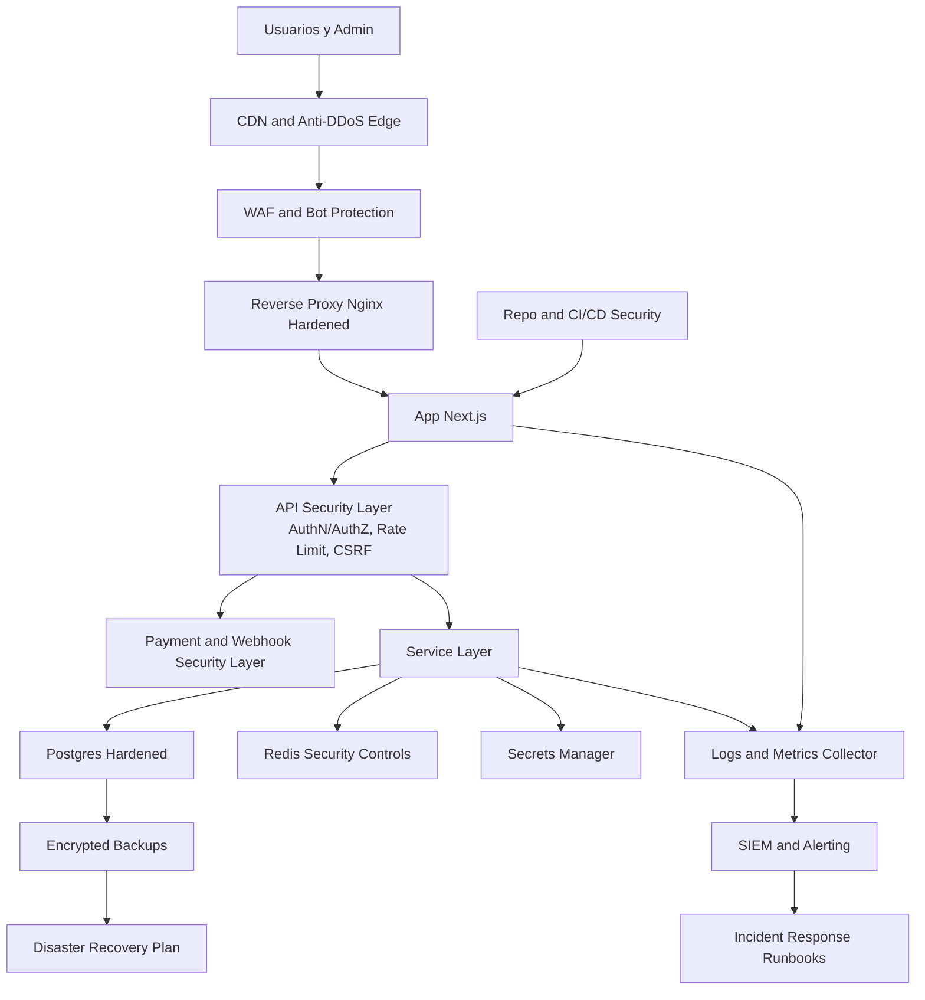

# Seguridad Enterprise CARVIPIX

## Documento tecnico formal

- Version: 1.0
- Fecha: 2026-07-06
- Estado: Auditoria y blueprint previo a implementacion
- Restricciones respetadas:
1. No se implementa codigo en esta etapa.
2. No se modifica Trading Engine.
3. No se modifica flujo funcional de pagos congelados.
4. No se almacena ni se recomienda almacenar datos sensibles de tarjetas.

## 0. Marco de referencia aplicado

Este blueprint usa como base:

1. OWASP Top 10 (Web).
2. OWASP API Security Top 10.
3. NIST Cybersecurity Framework (Identify, Protect, Detect, Respond, Recover).
4. CIS Controls (priorizando controles 1-8, 12, 13, 16).
5. Zero Trust (verificacion continua y minimo privilegio).
6. WAF/CDN, DDoS y bot protection de grado enterprise.

## 1. Resumen ejecutivo de riesgo actual

Nivel global actual (estimado): Medio-Alto para internet-facing production.

Fortalezas detectadas:

1. Consultas SQL mayormente parametrizadas.
2. Session token server-side hasheado en base de datos.
3. Rate limiting ya presente en varios endpoints sensibles.
4. Headers base de seguridad ya configurados (HSTS, X-Frame-Options, etc.).
5. Flujo de backups y monitoreo inicial (Prometheus, Loki, Grafana).

Brechas criticas detectadas:

1. Controles de sesion/rol parcialmente dependientes de cookies no httpOnly en cliente.
2. Rate limiter y auditoria en memoria (no distribuido/persistente entre instancias).
3. Falta de CSP fuerte y controles anti-XSS avanzados.
4. Proteccion anti-CSRF parcial (same-origin en rutas puntuales, no estandar global de token).
5. Webhooks con base de seguridad, pero adaptadores todavia en modo placeholder/mock en zonas de provider.
6. Nginx sin rate limit de borde ni reglas anti-bot/anti-DDoS en capa edge.
7. Admin autenticado por codigo estatico de entorno, sin MFA ni segundo factor.

## 2. Hallazgos por superficie de arquitectura actual

## 2.1 Frontend

Riesgos:

1. XSS por falta de Content-Security-Policy estricta.
2. Sesion de rol de interfaz apoyada en localStorage/cookie no httpOnly para estado visual.

Impacto:

1. Robo de sesion visual, phishing interno, inyeccion de scripts en escenarios de vulnerabilidad reflejada.

## 2.2 Backend y APIs

Riesgos:

1. Rate limit in-memory no resistente a despliegues multi-instancia.
2. Falta de esquema uniforme anti-CSRF en todos los POST autenticados por cookie.
3. Validaciones de payload heterogeneas entre endpoints.

Impacto:

1. Fuerza bruta distribuida.
2. Abuso de API por bots masivos.
3. Riesgo de bypass por inconsistencias entre rutas.

## 2.3 Auth y sesiones

Riesgos:

1. Cookie de rol cliente no httpOnly.
2. Flujo admin basado en codigo estatico sin MFA.
3. No se observa rotacion automatica de sesion en elevacion de privilegio.

Impacto:

1. Escalada por secuestro de navegador comprometido.
2. Riesgo de acceso admin por credencial filtrada.

## 2.4 Pagos y webhooks (sin modificar flujos congelados)

Riesgos:

1. Capa webhook tiene controles, pero aun hay componentes provider placeholder.
2. Necesidad de endurecer validacion criptografica por proveedor real en rollout final.

Impacto:

1. Manipulacion de estado de pago o eventos si firma no se valida de forma robusta en todos los providers.

## 2.5 Base de datos y secretos

Riesgos:

1. Entornos ejemplo con placeholders; riesgo operativo si se despliegan sin reemplazo.
2. Faltan evidencias de cifrado de backups y gestion centralizada de secretos.

Impacto:

1. Exposicion de credenciales.
2. Robo de datos ante compromiso de almacenamiento.

## 2.6 Infra, dominio, DNS, hosting

Riesgos (no verificables al 100% desde repo, requieren auditoria de infraestructura real):

1. Ausencia de definicion explicita de WAF/CDN gestionado en borde.
2. DNS hardening no evidenciado en repo (DNSSEC, CAA, registrar lock).
3. Segmentacion de red y hardening de host no documentado completamente.

Impacto:

1. DDoS, secuestro DNS, saturacion del sitio.

## 2.7 Repositorio, dependencias y CI/CD

Riesgos:

1. No se observa pipeline SAST/SCA/secret scanning obligatorio en CI.
2. Supply chain hardening incompleto (firmado de artefactos, SBOM, policy gate).

Impacto:

1. Inyeccion de dependencia maliciosa.
2. Exposicion de secretos por commits accidentales.

## 3. Matriz de amenazas solicitadas (20 puntos)

Escala de severidad: Critica, Alta, Media, Baja.
Prioridad: P0 inmediata, P1 alta, P2 media.

1) Hackers
- Severidad: Alta
- Que puede pasar: intrusiones por combinacion de fallos web/API.
- Medida: Zero Trust, WAF gestionado, hardening continuo, pentest trimestral.
- Empresas grandes usan: Cloudflare/Akamai/Fastly + SOC + SIEM.
- Herramientas: Cloudflare WAF, AWS WAF, Datadog SIEM, Splunk.
- Prioridad: P0.

2) Robo de cuentas
- Severidad: Critica
- Que puede pasar: toma de control de usuarios/admin.
- Medida: MFA admin obligatorio, deteccion de anomalias de login, device fingerprint, bloqueo adaptativo.
- Empresas grandes usan: Okta/Auth0/Cognito + risk-based auth.
- Herramientas: Auth0, Okta, Fingerprint, reCAPTCHA Enterprise.
- Prioridad: P0.

3) Robo de datos
- Severidad: Critica
- Que puede pasar: fuga de PII, sanciones, daño reputacional.
- Medida: cifrado en reposo y transito, minimizacion de datos, DLP y control de exportacion.
- Empresas grandes usan: KMS/Vault + DLP + tokenizacion.
- Herramientas: HashiCorp Vault, AWS KMS, Cloud DLP.
- Prioridad: P0.

4) Ataques a APIs
- Severidad: Alta
- Que puede pasar: abuso de endpoints, scraping, BOLA/BFLA.
- Medida: API gateway, schema validation, authz por recurso, rate limits por token/IP.
- Empresas grandes usan: API gateways con policy-as-code.
- Herramientas: Kong, Apigee, AWS API Gateway, OPA.
- Prioridad: P0.

5) DDoS
- Severidad: Critica
- Que puede pasar: caida total del sitio.
- Medida: CDN/WAF con DDoS L3/L4/L7, autoscaling, circuit breakers.
- Empresas grandes usan: Anycast + scrubbing centers.
- Herramientas: Cloudflare, Akamai, AWS Shield Advanced.
- Prioridad: P0.

6) Bots masivos
- Severidad: Alta
- Que puede pasar: saturacion, scraping, fraude.
- Medida: bot management, challenge dinamico, behavior scoring.
- Empresas grandes usan: bot defense administrada.
- Herramientas: Cloudflare Bot Management, DataDome, PerimeterX.
- Prioridad: P0.

7) Fuerza bruta
- Severidad: Alta
- Que puede pasar: takeover de cuentas.
- Medida: rate limiting distribuido, lockout inteligente, MFA, password policy fuerte.
- Empresas grandes usan: adaptive auth.
- Herramientas: Redis-based limiter, Auth0 attack protection.
- Prioridad: P0.

8) Estafadores
- Severidad: Alta
- Que puede pasar: fraude de identidad/pago.
- Medida: risk engine antifraude, velocity checks, listas de reputacion.
- Empresas grandes usan: fraud scoring y verificacion escalonada.
- Herramientas: Sift, Stripe Radar, ThreatMetrix.
- Prioridad: P1.

9) Programadores maliciosos (insider/supply chain)
- Severidad: Alta
- Que puede pasar: backdoors, exfiltracion.
- Medida: branch protection, mandatory reviews, signed commits, secretos externos al repo.
- Empresas grandes usan: SoD + auditoria de cambios.
- Herramientas: GitHub Advanced Security, CodeQL, OPA, Sigstore.
- Prioridad: P1.

10) Robo de datos bancarios
- Severidad: Critica
- Que puede pasar: impacto legal/PCI severo.
- Medida: no almacenar PAN/CVV, tokenizacion y provider PCI.
- Empresas grandes usan: PSP PCI Level 1.
- Herramientas: Stripe, Adyen, Mercado Pago (tokenized flows).
- Prioridad: P0.

11) Manipulacion de membresias
- Severidad: Alta
- Que puede pasar: acceso premium fraudulento.
- Medida: firmas de eventos de activacion, auditoria inmutable, reconciliacion diaria.
- Empresas grandes usan: event sourcing y control de integridad.
- Herramientas: Ledger DB, immutable logs.
- Prioridad: P1.

12) Manipulacion de pagos
- Severidad: Critica
- Que puede pasar: fraude financiero y chargebacks.
- Medida: idempotencia estricta, state machine cerrada, doble validacion webhook + reconciliacion.
- Empresas grandes usan: payment orchestration con antifraude.
- Herramientas: PSP risk suites + SIEM.
- Prioridad: P0.

13) Ataques a webhooks
- Severidad: Alta
- Que puede pasar: eventos falsos, activaciones ilegales.
- Medida: verificacion criptografica por proveedor, timestamp tolerance, replay protection, IP allowlist opcional.
- Empresas grandes usan: signed webhooks y event store deduplicado.
- Herramientas: HMAC validator, mTLS (si aplica), Redis replay cache.
- Prioridad: P0.

14) Inyeccion SQL
- Severidad: Alta
- Que puede pasar: exfiltracion/borrado de datos.
- Medida: parametrizacion total + validacion estricta + least-privilege DB roles.
- Empresas grandes usan: prepared statements + DB firewall.
- Herramientas: pg parameterized queries, pgaudit, SQL firewall.
- Prioridad: P0.

15) XSS
- Severidad: Alta
- Que puede pasar: robo de sesiones y datos en cliente.
- Medida: CSP estricta, escaping, sanitizer en entradas ricas, Trusted Types (si aplica).
- Empresas grandes usan: CSP report-only -> enforcement.
- Herramientas: Helmet/CSP builder, DOMPurify.
- Prioridad: P0.

16) CSRF
- Severidad: Alta
- Que puede pasar: acciones no deseadas con sesion activa.
- Medida: CSRF token estandar, sameSite=strict para sesiones sensibles, check origin+referer.
- Empresas grandes usan: anti-CSRF framework-wide.
- Herramientas: csrf tokens server-side, double submit cookie.
- Prioridad: P0.

17) SSRF
- Severidad: Media-Alta
- Que puede pasar: acceso a metadata interna o red privada.
- Medida: egress allowlist, bloqueo de rangos internos, proxy saliente seguro.
- Empresas grandes usan: outbound proxy controlado.
- Herramientas: egress firewall, URL allowlist validator.
- Prioridad: P1.

18) Exposicion de secretos/API keys
- Severidad: Critica
- Que puede pasar: takeover de servicios externos.
- Medida: secret manager, rotacion, scan automatico en repo y CI.
- Empresas grandes usan: vault central + rotation jobs.
- Herramientas: Vault, AWS Secrets Manager, GitHub Secret Scanning.
- Prioridad: P0.

19) Accesos no autorizados
- Severidad: Critica
- Que puede pasar: fuga/alteracion de datos admin y cliente.
- Medida: RBAC/ABAC server-side estricto, session hardening, MFA admin, auditoria continua.
- Empresas grandes usan: IAM centralizado + policy engine.
- Herramientas: OPA, Auth0 RBAC, audit SIEM.
- Prioridad: P0.

20) Saturacion del sitio
- Severidad: Alta
- Que puede pasar: degradacion o downtime.
- Medida: edge rate limiting, autoscaling, queueing y graceful degradation.
- Empresas grandes usan: traffic shaping en edge + cache.
- Herramientas: CDN caching, WAF rules, autoscaling group.
- Prioridad: P0.

## 4. Riesgos actuales priorizados para CARVIPIX (auditoria accionable)

## P0 inmediato

1. Endurecer auth admin (reemplazar codigo estatico por MFA + identity provider).
2. Estandarizar anti-CSRF global para endpoints state-changing autenticados por cookie.
3. Migrar rate limiting de memoria a backend distribuido (Redis) con politicas por endpoint.
4. Implementar WAF/CDN y Bot Management en edge.
5. Definir CSP estricta y rollout progresivo.
6. Secret management enterprise (fuera de archivos de entorno locales).
7. Webhooks: enforcement estricto de firma por proveedor real y replay cache distribuida.

## P1 alto

1. Auditoria inmutable/persistente (no solo in-memory) para eventos criticos.
2. SAST/SCA/secret scanning obligatorio en CI con gates de bloqueo.
3. Zero Trust interno (service-to-service authn/authz).
4. Deteccion antifraude y anomalias en logins/pagos/membresias.

## P2 medio

1. Programa de pentesting continuo.
2. Bug bounty privado.
3. Mejoras avanzadas de resiliencia multi-region.

## 5. Herramientas recomendadas por dominio

Identidad y acceso:

1. Auth0 u Okta (MFA, anomaly detection, bot detection).
2. RBAC/ABAC con policy-as-code (OPA).

Edge y proteccion web:

1. Cloudflare Enterprise o Akamai (WAF + DDoS + Bot).
2. Rate limiting y challenge adaptativo por reputacion.

API security:

1. Kong o AWS API Gateway con schemas y quotas.
2. OpenAPI schema validation obligatoria en runtime.

Secretos y llaves:

1. HashiCorp Vault o AWS Secrets Manager.
2. Rotacion automatica de credenciales.

Monitoreo y respuesta:

1. SIEM (Splunk/Datadog/Microsoft Sentinel).
2. SOAR para respuestas repetibles.

Supply chain:

1. GitHub Advanced Security (CodeQL, secret scan, dependabot).
2. SBOM + firma de imagenes (Syft + Cosign).

## 6. Plan por fases (ejecutable, sin codigo en esta etapa)

## Fase A - Controles criticos de acceso y sesion

Objetivo:
Cerrar riesgos de acceso no autorizado y takeover.

Entregables:

1. Blueprint de MFA admin.
2. Politica de sesion (rotacion, expiracion, invalidacion).
3. Modelo RBAC/ABAC unificado.

Cierre:

1. Ninguna ruta sensible depende de estado cliente manipulable.

## Fase B - Seguridad API y anti-abuso

Objetivo:
Blindar APIs ante BOLA, brute force, bots y scraping.

Entregables:

1. API threat model por endpoint.
2. Matriz de rate limits distribuida.
3. Politica anti-CSRF global.

Cierre:

1. Todos los endpoints state-changing con defensa anti-CSRF y authz por recurso.

## Fase C - Pago y webhook hardening (sin alterar negocio congelado)

Objetivo:
Elevar integridad de eventos y estado de pagos.

Entregables:

1. Estandar de firma por proveedor.
2. Replay protection distribuida.
3. Reconciliacion y alertas antifraude.

Cierre:

1. Webhooks no validos o replays no alteran estado.

## Fase D - Datos, secretos y cumplimiento

Objetivo:
Evitar fuga de informacion y compromisos de credenciales.

Entregables:

1. Secret management centralizado.
2. Politica de cifrado y retencion de datos.
3. Clasificacion de datos y minimizacion.

Cierre:

1. No existen secretos en repositorio ni runtime sin vault.

## Fase E - Edge, DDoS y resiliencia

Objetivo:
Evitar caida de plataforma por ataques de volumen o bots.

Entregables:

1. WAF/CDN configurado.
2. Runbook de mitigacion DDoS.
3. Pruebas de carga y caos.

Cierre:

1. Sitio se mantiene operativo bajo escenarios de saturacion definidos.

## Fase F - Observabilidad y respuesta a incidentes

Objetivo:
Detectar, contener y recuperar rapidamente.

Entregables:

1. Matriz de alertas de seguridad.
2. Playbooks de incidente (IRP).
3. Simulacros tabletop y postmortem templates.

Cierre:

1. MTTR y MTTD dentro de umbrales acordados.

## Fase G - Supply chain y gobernanza

Objetivo:
Reducir riesgo de codigo malicioso y dependencias comprometidas.

Entregables:

1. Gates obligatorios en CI (SAST/SCA/secret scanning).
2. SBOM y firma de artefactos.
3. Politica de branch protection y aprobacion dual.

Cierre:

1. Ningun deploy sin pasar gates de seguridad.

## 7. Checklist antes de produccion (Security Go/No-Go)

1. MFA obligatorio para admin y operaciones sensibles.
2. Session cookies sensibles con httpOnly + secure + sameSite apropiado.
3. Anti-CSRF activo en toda accion state-changing.
4. WAF/CDN y bot protection activos con reglas validadas.
5. Rate limit distribuido en edge y backend.
6. Firma de webhooks y replay protection validadas.
7. No almacenamiento de datos sensibles de tarjeta (PAN/CVV).
8. Secrets solo en vault/secret manager, con rotacion activa.
9. SAST/SCA/secret scanning bloqueando pipeline.
10. Logs de seguridad centralizados en SIEM.
11. Alertas de seguridad y on-call definidos.
12. Backups cifrados, restore probado y DR drill aprobado.
13. Hardening de DNS (DNSSEC, CAA, lock registrar) validado.
14. Pentest externo aprobado sin hallazgos criticos abiertos.

## 8. Recomendacion final de stack de seguridad para CARVIPIX

Stack recomendado (enterprise pragmatica):

1. Edge: Cloudflare Enterprise (WAF, DDoS, Bot Management, rate limit global).
2. Identity: Auth0/Okta con MFA, anomaly detection y RBAC.
3. API Security: Kong o AWS API Gateway + validacion OpenAPI + OPA.
4. Secrets: Vault o AWS Secrets Manager + rotacion automatica.
5. Data: Postgres con cifrado en reposo, backups cifrados, pgaudit.
6. Observabilidad: Prometheus + Loki + SIEM (Datadog/Splunk/Sentinel).
7. Supply chain: GitHub Advanced Security + CodeQL + Dependabot + Cosign.
8. Incidentes: Runbooks IR, tabletop trimestral, plan de continuidad operativo.

## 9. Recomendaciones puntuales para restricciones explicitadas

1. No guardar datos sensibles de tarjetas:
- Mantener tokenizacion total con PSP PCI, sin almacenar PAN/CVV en CARVIPIX.

2. No exponer API keys:
- Mover llaves a secret manager y bloquear secretos en repo/CI.

3. No permitir accesos sin sesion:
- Unificar guardas server-side para toda API privada y rutas sensibles.

4. No permitir bots masivos:
- Bot management en edge + fingerprinting + challenges adaptativos.

5. No permitir caida facil por ataque:
- WAF/CDN + DDoS protection + autoscaling + graceful degradation.

6. No modificar pagos congelados y no tocar trading engine:
- Todo lo anterior se implementa como capa transversal de seguridad y control operativo, sin alterar logica de negocio congelada.

## 10. Conclusión tecnica

CARVIPIX tiene base funcional para evolucionar a seguridad enterprise, pero requiere cerrar brechas P0 antes de go-live exigente: identidad robusta admin, anti-CSRF global, rate limit distribuido, WAF/CDN con bot y DDoS, gestion central de secretos y observabilidad de seguridad con respuesta a incidentes.

Este documento queda como blueprint de seguridad definitivo previo a implementacion.

## 11. Arquitectura definitiva de Seguridad Enterprise (target pre-lanzamiento)

Arquitectura objetivo de seguridad para CARVIPIX antes del lanzamiento:

Capas obligatorias antes del lanzamiento:

1. Edge Security Layer: CDN, WAF, DDoS, Anti-Bot, rate limit de borde.
2. Identity and Session Layer: autenticacion robusta, MFA admin, gestion de sesiones segura.
3. API Protection Layer: authz por recurso, anti-CSRF, schema validation, throttling distribuido.
4. Data Protection Layer: secretos centralizados, cifrado en transito y reposo, DB hardening.
5. Detection and Response Layer: logs centralizados, SIEM, alertas y playbooks.
6. Resilience Layer: backups cifrados, DR probado, proteccion de dominio y DNS.
7. Software Supply Chain Layer: repositorio y pipeline CI/CD endurecidos.

## 12. Matriz definitiva de componentes de seguridad

Escala usada:

1. Costo: Bajo (<500 USD/mes), Medio (500-3000 USD/mes), Alto (>3000 USD/mes).
2. Complejidad: Baja, Media, Alta.
3. Estado: Obligatorio Pre-Lanzamiento o Posterior v2.

| Componente | Estado | Costo aprox | Complejidad | Beneficio para CARVIPIX |
|---|---|---|---|---|
| CDN | Obligatorio Pre-Lanzamiento | Medio | Media | Reduce latencia, absorbe trafico y ayuda contra saturacion |
| WAF | Obligatorio Pre-Lanzamiento | Medio | Media | Bloquea OWASP Top 10 y ataques web comunes |
| Proteccion DDoS | Obligatorio Pre-Lanzamiento | Medio-Alto | Media | Evita caida de la plataforma por volumen L3/L4/L7 |
| Proteccion Anti-Bot | Obligatorio Pre-Lanzamiento | Medio-Alto | Alta | Mitiga bots masivos, scraping y abuso de API |
| Firewall (host/red) | Obligatorio Pre-Lanzamiento | Bajo-Medio | Media | Reduce superficie de ataque y puertos expuestos |
| Reverse Proxy endurecido | Obligatorio Pre-Lanzamiento | Bajo | Media | Control de headers, TLS, timeouts y saneamiento de trafico |
| Gestion de secretos | Obligatorio Pre-Lanzamiento | Medio | Media | Evita exposicion de API keys y credenciales criticas |
| Cifrado de datos (transito/reposo) | Obligatorio Pre-Lanzamiento | Medio | Media | Protege PII y datos sensibles ante compromiso |
| Proteccion de base de datos | Obligatorio Pre-Lanzamiento | Medio | Alta | Reduce SQL abuse, exfiltracion y privilegios excesivos |
| Sistema de autenticacion robusto | Obligatorio Pre-Lanzamiento | Medio | Alta | Reduce robo de cuentas y accesos no autorizados |
| MFA para administradores | Obligatorio Pre-Lanzamiento | Bajo-Medio | Baja-Media | Cierra riesgo critico de takeover admin |
| Gestion de sesiones segura | Obligatorio Pre-Lanzamiento | Bajo-Medio | Media | Previene secuestro/reuso de sesion |
| Proteccion de APIs | Obligatorio Pre-Lanzamiento | Medio | Alta | Mitiga BOLA/BFLA, abuso y manipulacion de flujos |
| Monitoreo (metrics/traces/health) | Obligatorio Pre-Lanzamiento | Bajo-Medio | Media | Detecta degradacion temprana y ataques en progreso |
| SIEM | Obligatorio Pre-Lanzamiento (minimo viable) | Medio-Alto | Alta | Correlacion de eventos y deteccion avanzada |
| Logs centralizados | Obligatorio Pre-Lanzamiento | Bajo-Medio | Media | Trazabilidad forense y cumplimiento operativo |
| Alertas de seguridad | Obligatorio Pre-Lanzamiento | Bajo | Media | Reduce MTTD y acelera contencion |
| Backups cifrados | Obligatorio Pre-Lanzamiento | Bajo-Medio | Media | Recuperacion de datos ante incidente/ransomware |
| Recuperacion ante desastres (DR) | Obligatorio Pre-Lanzamiento | Medio | Alta | Asegura continuidad de negocio (RTO/RPO) |
| Escaneo de vulnerabilidades | Obligatorio Pre-Lanzamiento | Bajo-Medio | Media | Detecta brechas antes de explotacion |
| Dependencias (SCA) | Obligatorio Pre-Lanzamiento | Bajo-Medio | Baja-Media | Reduce supply-chain risk |
| Proteccion del servidor | Obligatorio Pre-Lanzamiento | Bajo-Medio | Media | Hardening SO, parches y control de acceso |
| Proteccion del dominio | Obligatorio Pre-Lanzamiento | Bajo | Baja | Reduce secuestro de dominio y abuso de marca |
| Proteccion DNS | Obligatorio Pre-Lanzamiento | Bajo-Medio | Media | Mitiga hijacking y envenenamiento DNS |
| Proteccion del correo | Obligatorio Pre-Lanzamiento | Bajo-Medio | Media | Reduce spoofing/phishing (SPF, DKIM, DMARC) |
| Proteccion del repositorio | Obligatorio Pre-Lanzamiento | Bajo-Medio | Media | Previene commits maliciosos y fuga de secretos |
| Proteccion del pipeline CI/CD | Obligatorio Pre-Lanzamiento | Medio | Alta | Evita despliegues comprometidos y fraude en release |

Componentes que pueden esperar a v2 (sin bloquear go-live si lo anterior esta completo):

1. SOAR avanzado con automatizacion completa de respuesta.
2. Bug bounty publico.
3. Multi-region activa-activa.
4. DLP avanzada de contenido en tiempo real.

## 13. Roadmap de Seguridad (4 fases, ordenado por prioridad)

## Fase 1 - Blindaje critico de acceso y perimetro (Prioridad maxima)

Incluye:

1. CDN + WAF + DDoS + Anti-Bot en edge.
2. MFA admin obligatorio.
3. Endurecimiento de sesiones y authz server-side.
4. Rate limiting distribuido (edge + backend).
5. Anti-CSRF global para rutas state-changing.

Resultado esperado:

1. Bloqueo de vectores de ataque mas probables antes de exposicion publica.

## Fase 2 - Proteccion de datos, APIs y pagos/webhooks (Prioridad alta)

Incluye:

1. Secret manager y rotacion de credenciales.
2. Cifrado y hardening de base de datos.
3. API protection por contrato y autorizacion por recurso.
4. Endurecimiento criptografico de webhooks y anti-replay distribuido.
5. Controles antifraude para membresias/pagos.

Resultado esperado:

1. Integridad de transacciones y reduccion de riesgo de exfiltracion.

## Fase 3 - Deteccion, observabilidad y respuesta (Prioridad alta-media)

Incluye:

1. Logs centralizados y SIEM minimo viable.
2. Alertas de seguridad por severidad.
3. Runbooks de incidentes y simulacros.
4. Backups cifrados con restore validado.
5. DR drill con objetivos RTO/RPO medidos.

Resultado esperado:

1. Capacidad real de detectar, contener y recuperar incidentes.

## Fase 4 - Supply chain, hardening avanzado y mejora continua (Prioridad media)

Incluye:

1. SAST/SCA/secret scanning bloqueando CI/CD.
2. SBOM y firma de artefactos.
3. Hardening continuo de host, dominio, DNS y correo.
4. Pentest externo recurrente.
5. Preparacion de capacidades v2 (SOAR, bug bounty privado).

Resultado esperado:

1. Madurez enterprise sostenida y reduccion de riesgo residual.

## Decisión de lanzamiento recomendada

Go-Live solo si Fase 1 y Fase 2 estan cerradas al 100%, y Fase 3 al menos en minimo viable operativo.

