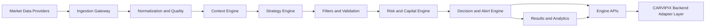
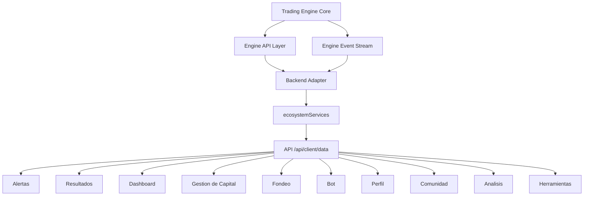

# CARVIPIX Trading Engine Blueprint Definitivo

## Estado del documento

- Version: 1.0
- Fecha: 2026-07-06
- Tipo: Arquitectura tecnica (sin implementacion)
- Objetivo: Base definitiva para construir el cerebro de CARVIPIX

## Principios de diseno

1. Engine desacoplado de UI y de pagos.
2. Contratos estables antes que codigo.
3. Trazabilidad completa de cada decision.
4. Seguridad y control de riesgo por defecto.
5. Escalabilidad horizontal desde el inicio.
6. Observabilidad de nivel produccion desde fase 1.

## 1) Arquitectura general del Engine

El Trading Engine se define como una plataforma de decision en tiempo real basada en eventos. Se compone de 8 macrocapas:

1. Ingestion de mercado.
2. Normalizacion y calidad de datos.
3. Procesamiento de contexto de mercado.
4. Pipeline de estrategias.
5. Pipeline de filtros y validaciones.
6. Motor de riesgo y capital.
7. Motor de ejecucion logica y alertas.
8. Capa de resultados, aprendizaje y telemetria.

## 2) Flujo completo de datos

1. El proveedor entrega ticks/candles/order book/events.
2. Ingestion Gateway recibe, firma origen, asigna timestamp canonico.
3. Quality Layer valida integridad, latencia, huecos, duplicados.
4. Context Engine construye estado de mercado multi-horizonte.
5. Strategy Engine evalua oportunidades y propone candidatos.
6. Filters y Validation aplican reglas de elegibilidad.
7. Risk/Capital Engine calcula tamano, exposicion y limites.
8. Decision Engine aprueba/rechaza y emite alerta/decision.
9. Result Engine registra ciclo de vida completo del trade.
10. APIs exponen estado, alertas, metricas y trazabilidad a CARVIPIX.

## 3) Entrada de datos del mercado

Fuentes soportadas (arquitectura):

1. Feed primario de precios (ticks y candles).
2. Feed secundario de respaldo (failover).
3. Feed de calendario/noticias de alto impacto.
4. Feed de sesion/horarios y metadata de instrumentos.

Contrato de entrada canonica:

1. Instrumento: simbolo, tipo de activo, mercado.
2. Tiempo: event_time, receive_time, exchange_time.
3. Precio: bid/ask/last y OHLCV por timeframe.
4. Calidad: source_id, latency_ms, gap_flag, confidence.

Politicas:

1. Clock synchronization obligatoria.
2. Idempotencia por source_event_id.
3. Reconciliacion entre feeds cuando divergen.

## 4) Procesamiento interno

Pipeline interno en 5 etapas:

1. Market State Builder: construye estado continuo por simbolo/timeframe.
2. Feature Extractor: genera features estructuradas (sin definir indicadores concretos en este documento).
3. Opportunity Assembler: consolida setup candidato.
4. Decision Orchestrator: coordina estrategia, filtros, validacion y riesgo.
5. Decision Committer: persiste decision, emite eventos y snapshot.

Modo de ejecucion:

1. Event-driven para tiempo real.
2. Batch replay para backtesting/simulacion.
3. Deterministico por version de config para reproducibilidad.

## 5) Sistema de estrategias

Arquitectura (sin estrategias concretas):

1. Strategy Registry: catalogo versionado de estrategias habilitadas.
2. Strategy Runtime: ejecutor aislado por estrategia.
3. Strategy Contract: input canonico y output canonico de oportunidad.
4. Strategy Policy: activacion por simbolo, sesion, perfil de riesgo.

Output estandar de estrategia:

1. signal_candidate_id.
2. side potencial.
3. zona de entrada propuesta.
4. hipotesis resumida.
5. score base.

## 6) Sistema de filtros

Capa posterior a estrategia para reducir falsos positivos.

Categorias de filtros arquitectonicos:

1. Filtro de liquidez.
2. Filtro de volatilidad operable.
3. Filtro de contexto de sesion.
4. Filtro de eventos de alto impacto.
5. Filtro de correlacion y concentracion.
6. Filtro de saturacion operativa.

Resultado de filtros:

1. pass/fail por filtro.
2. severidad.
3. motivo trazable.

## 7) Sistema de validacion

Capas de validacion:

1. Validacion tecnica de datos.
2. Validacion de consistencia del setup.
3. Validacion de reglas de negocio del engine.
4. Validacion de compliance interna.

Decision policy:

1. Hard fail: bloquea candidate.
2. Soft fail: reduce confianza o deriva a pending.
3. Warning: permite seguir y registra auditoria.

## 8) Gestion de riesgo

Risk Engine opera en 4 niveles:

1. Nivel trade: riesgo por operacion.
2. Nivel simbolo: riesgo agregado por instrumento.
3. Nivel cartera: riesgo total abierto.
4. Nivel diario/semanal: guardrails de perdida y actividad.

Componentes:

1. Position Sizing Engine.
2. Exposure Controller.
3. Drawdown Guard.
4. Kill Switch Logic.

Salidas:

1. notional permitido.
2. stop/take policy envelope.
3. estado de permiso operativo.

## 9) Gestion de capital

Capital Engine sincroniza el riesgo con cuentas y programas.

Responsabilidades:

1. Mapear reglas de capital por tipo de cuenta.
2. Asignar cupos de riesgo por usuario/cuenta.
3. Mantener equity, balance virtual, margen y reservas.
4. Publicar snapshots para modulos de Gestion de Capital/Fondeo.

Modelo:

1. Capital Policy.
2. Capital Allocation Ledger.
3. Capital Utilization Tracker.

## 10) Generacion de alertas

Alert Engine transforma decisiones en eventos consumibles por plataforma.

Tipos de alerta:

1. Nueva oportunidad.
2. Confirmacion de ejecucion logica.
3. Cambio de estado.
4. Cierre de ciclo.
5. Alerta de riesgo operativo.

Contrato minimo de alerta:

1. alert_id, decision_id, signal_id.
2. symbol, side, state.
3. confidence, priority, rationale.
4. entry/stop/take envelope.
5. timestamps.

## 11) Sistema de resultados

Results Engine mantiene verdad historica del rendimiento.

Funciones:

1. Lifecycle tracking (desde candidate hasta cierre).
2. Attribution por estrategia/filtro/contexto.
3. KPI pipeline por ventana temporal.
4. Curvas y distribuciones para analitica.

Salidas para CARVIPIX:

1. resultados agregados.
2. historial de operaciones.
3. metricas por modulo (alertas, bot, capital, fondeo).

## 12) Integracion con el resto de CARVIPIX

Regla de frontera:

1. CARVIPIX consume Engine via adapters/contracts, nunca acceso directo a internals.

Integraciones directas:

1. Alertas: feed de señales y estados.
2. Resultados: metricas y trazabilidad.
3. Dashboard: KPIs de motor y salud.
4. Bot: estado de instancias y telemetria.
5. Capital/Fondeo: snapshots de riesgo y capital.
6. Perfil/Comunidad/Analisis/Herramientas: consumo de datos validados del engine.

## 13) Eventos que emitira

Taxonomia de eventos (topic-first):

1. engine.market.*
2. engine.signal.*
3. engine.decision.*
4. engine.alert.*
5. engine.risk.*
6. engine.capital.*
7. engine.result.*
8. engine.health.*
9. engine.backtest.*
10. engine.simulation.*

Ejemplos canonicos:

1. engine.signal.candidate.created
2. engine.decision.approved
3. engine.decision.rejected
4. engine.alert.created
5. engine.alert.state.changed
6. engine.result.trade.closed
7. engine.risk.limit.hit
8. engine.health.degraded

## 14) APIs que consumira la plataforma

Consumo esperado desde CARVIPIX (lectura):

1. GET /engine/health
2. GET /engine/state
3. GET /engine/alerts
4. GET /engine/alerts/{id}
5. GET /engine/decisions
6. GET /engine/metrics
7. GET /engine/results/summary
8. GET /engine/results/history
9. GET /engine/risk/snapshot
10. GET /engine/capital/snapshot

## 15) APIs que expondra el Engine

Superficie completa (lectura + control):

1. API de consulta (read models).
2. API de control operativo (start/stop/pause/resume en ambiente admin).
3. API de configuracion versionada.
4. API de replay/backtest/simulacion.
5. API de eventos (stream websocket o pub/sub bridge).

Reglas:

1. Versionado obligatorio (/v1, /v2).
2. Contratos tipados y backward-compatible.
3. Auth fuerte por rol (admin/system/client-proxy).

## 16) Base de datos necesaria

Dominios de almacenamiento:

1. market_data_raw (retencion corta, alta frecuencia).
2. market_data_aggregates (candles y snapshots).
3. signal_candidates.
4. decisions.
5. alerts.
6. trade_lifecycle.
7. risk_events.
8. capital_snapshots.
9. strategy_registry.
10. filter_validation_audit.
11. metrics_timeseries.
12. backtest_runs.
13. simulation_runs.
14. optimization_runs.
15. engine_logs.

Criterios de diseno:

1. Identificadores globales (ULID/UUID).
2. Indices por symbol/time/state.
3. Particionado temporal en tablas volumetricas.
4. Politicas de retencion y archivado.

## 17) Estructura de modulos internos

Propuesta de modulos del engine:

1. ingestion-module.
2. market-state-module.
3. strategy-module.
4. filter-module.
5. validation-module.
6. risk-module.
7. capital-module.
8. decision-module.
9. alert-module.
10. results-module.
11. backtest-module.
12. simulation-module.
13. optimization-module.
14. observability-module.
15. api-module.

## 18) Comunicacion entre componentes

Modelo hibrido:

1. Sincrono para queries de bajo costo.
2. Asincrono por eventos para pipeline de decision.

Mecanismos:

1. Internal Event Bus (in-process).
2. Durable Event Stream (inter-process).
3. Command bus para acciones de control.
4. Query bus para read models.

Patrones:

1. Outbox pattern para confiabilidad.
2. Idempotent consumer.
3. Retry con backoff y dead-letter.

## 19) Logging

Arquitectura de logging:

1. Logs estructurados JSON.
2. Correlation IDs por decision.
3. Trace IDs por request.
4. Niveles: debug, info, warn, error, fatal.

Categorias:

1. market_ingestion.
2. strategy_evaluation.
3. filter_validation.
4. risk_capital.
5. decision_alert.
6. api_access.
7. security_audit.

## 20) Observabilidad

Pilares:

1. Metrics.
2. Traces.
3. Logs.
4. Health checks.

SLIs recomendados:

1. decision_latency_p95.
2. market_data_lag_ms.
3. alert_emit_success_rate.
4. decision_reproducibility_rate.
5. data_quality_pass_rate.

SLOs iniciales:

1. p95 decision latency <= 1500 ms.
2. event delivery success >= 99.9%.
3. data quality pass >= 99.5%.

## 21) Backtesting

Arquitectura de backtesting:

1. Replay deterministico de datos historicos.
2. Ejecucion con mismas reglas del runtime real.
3. Reportes comparables por version de engine/config.
4. Almacenamiento de run, metricas, errores y artefactos.

Capacidades:

1. Batch multi-simbolo.
2. Ventanas temporales configurables.
3. Reproducibilidad por seed/version.

## 22) Optimizacion

Optimization Engine (fase posterior al backtesting base):

1. Explorar configuraciones de parametros arquitectonicos.
2. Evaluar robustez en diferentes regimens.
3. Penalizar sobreajuste con validacion cruzada temporal.

Output:

1. ranking de configuraciones.
2. sensibilidad de parametros.
3. recomendacion de configuracion candidata.

## 23) Simulacion

Simulation Layer (paper/live-sim):

1. Simulacion en tiempo real con market feed vivo.
2. Sin impacto en cuentas reales.
3. Mismas reglas de riesgo/capital del modo productivo.

Estados:

1. dry-run.
2. paper-trading.
3. shadow-mode (comparativo contra decision esperada).

## 24) IA futura

Integracion IA planificada como capa complementaria, no decisora unica.

Roles posibles de IA:

1. Clasificacion de contexto.
2. Priorizacion de oportunidades.
3. Explicabilidad asistida de decisiones.
4. Deteccion de anomalias operativas.

Guardrails:

1. IA no puede saltar risk hard-fails.
2. IA no publica alertas sin pasar pipeline completo.
3. Todo output IA debe ser auditable y versionado.

## 25) Escalabilidad

Estrategia de escalabilidad:

1. Escala horizontal por simbolo y/o mercado.
2. Particionado por tenant/cuenta cuando aplique.
3. Separacion compute-bound (decision) y io-bound (ingestion/api).
4. Cache de read models para consumo UI masivo.

Arquitectura objetivo:

1. Multi-worker stateless para evaluacion.
2. State stores especializados para series temporales y eventos.
3. Control plane centralizado para configuracion y releases.

## Mapa final de integracion con CARVIPIX

## Checklist de cierre de blueprint

1. Sin codigo implementado.
2. Sin definir estrategias concretas.
3. Sin definir indicadores concretos.
4. Arquitectura completa del cerebro del sistema definida.
5. Contratos de integracion listos para siguiente etapa de construccion.
