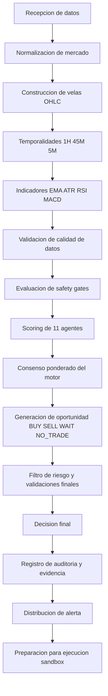

# Auditoria Trading Engine - Flujo End to End

Fecha: 2026-07-09
Objetivo: documentar el flujo desde dato de mercado hasta decision, registro y preparacion de ejecucion.

## Flujo completo

## Implementacion por etapa
- Recepcion y proveedor: app/engine/data/realDataProvider.ts, app/engine/data/demoDataSource.ts
- Validacion de datos: app/engine/data/dataValidator.ts
- Indicadores: app/engine/backtesting/backtestEngine.ts, app/engine/agents/index.ts
- Validacion de tendencia: app/engine/strategy/trendValidation.ts
- Pullback 45M: app/engine/strategy/pullbackValidator.ts (pendiente)
- Generacion de senal 1H/45M/5M: app/engine/core/signalGenerationEngine.ts
- Safety gates: app/engine/core/safetyGates.ts
- Consenso: app/engine/core/decisionEngine.ts
- Creacion de alerta: app/engine/core/engine.ts, app/engine/alerts/carvipixAlerts.ts
- Registro y lifecycle: app/engine/core/auditEngine.ts, app/engine/core/lifecycleManager.ts
- Ejecucion sandbox: app/backend/system/execution-runtime.ts

## Entradas y salidas auditables
- Entradas: candle, tick, indicadores tecnicos, estado de cuenta, estado de riesgo.
- Salidas: alerta, decision log, lifecycle log, metricas de motor, estado de ejecucion sandbox.

## Estado de trazabilidad
- Trazabilidad base: disponible por decision log y audit log.
- Brecha principal: faltan estandares de explicabilidad matematica por decision en formato institucional unico.
